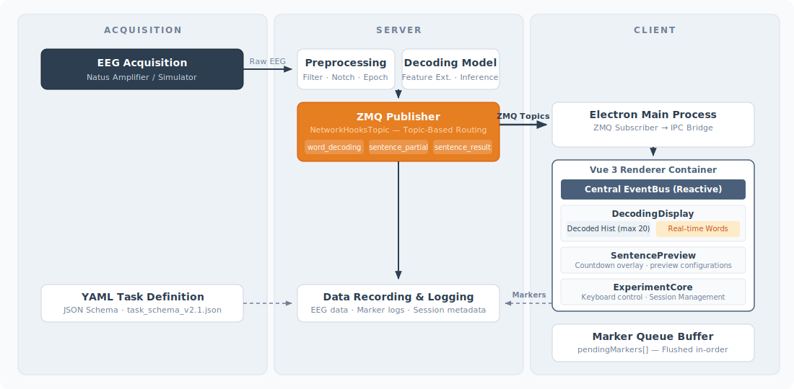
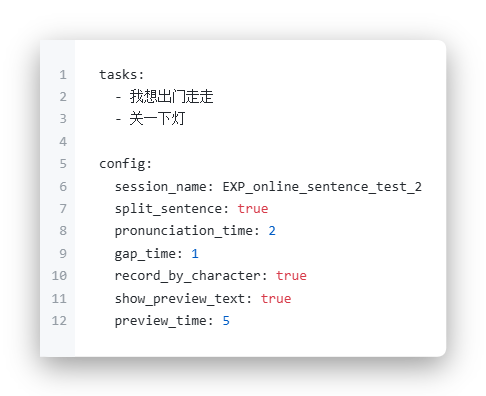
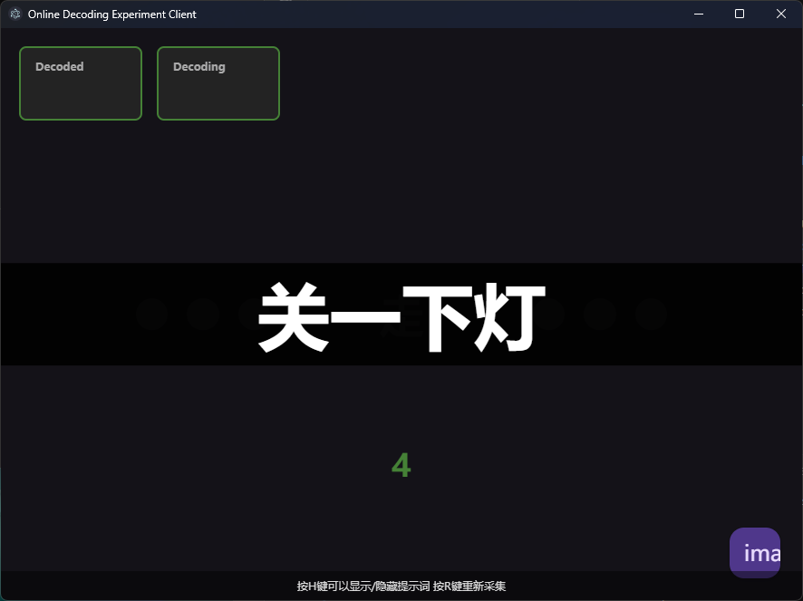
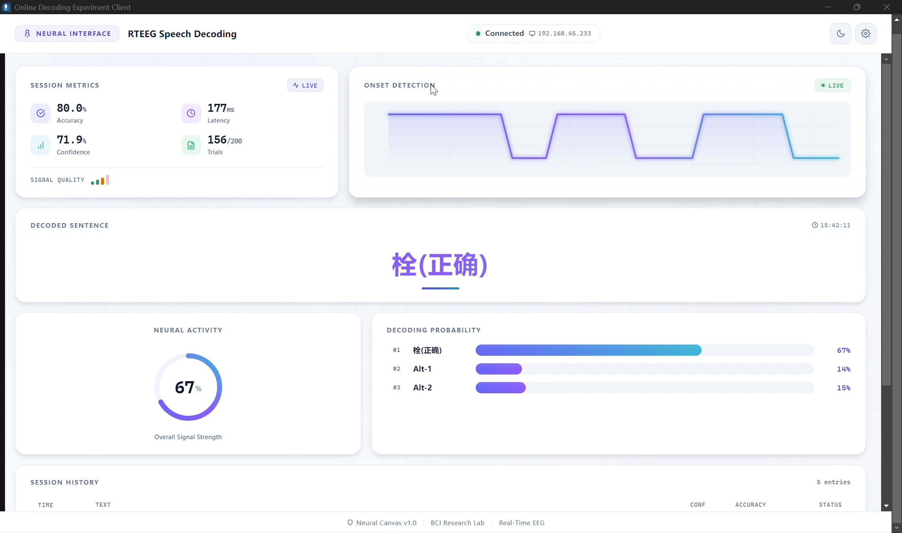

# 面向 rteeg 语音客户端的协议感知采集基础设施

**短期进展报告**\
Peibin / rteeg 语音项目\
2026年7月

***

# 摘要

* 近期工作聚焦于 **rteeg-speech-client**，而非新型神经解码器。

* 核心成果是为神经语音解码实验打造了一套更具**协议感知能力的采集前端**。

* 主要改进包括：

  * YAML 任务管控

  * 句子预览与字符级执行

  * 实时/最终解码结果分屏展示

  * 队列化 marker 投递

  * 辅助音频与截图采集

<!-- - 证据边界：仅包含实现层面的证据；暂未涉及准确率、临床效果或正式延迟指标的结论。 -->

***

# 研究动机

神经语音解码系统的支撑要素远不止模型推理。

* 视觉刺激必须具备可重复性。

* 实验事件必须完成标记。

* 采集过程中必须能观测在线输出结果。

* 辅助行为轨迹应可与神经数据完成对齐。

**定位：** 本阶段工作完成采集界面的搭建，为后续以可控、可观测、可审计的方式采集解码数据奠定基础。

***

# 系统整体架构

***

<!-- _class: two-cols -->

# 客户端在数据链路中的定位

语音客户端是面向受试者与实验操作人员的交互层。

| 职责                  | 作用                                |
| --------------------- | ----------------------------------- |
| 加载任务文件          | 定义可复现的提示内容与时间节奏      |
| 呈现刺激材料          | 控制受试者所见内容                  |
| 发送 marker           | 标记 session、句子、单词或字符事件  |
| 接收解码消息          | 展示在线反馈结果                    |
| 采集音频/截图         | 提供辅助审计数据流                  |

采集流程

任务 YAML→预览界面→Marker 队列→服务端录制→解码器反馈

<!-- 
建议文件：<code>figures/acquisition-flow.svg</code>
 -->

***

<!-- _class: two-cols -->

# 执行层级

| 层级                 | 核心职责                                                                 | 研究价值                                   |
| -------------------- | ------------------------------------------------------------------------ | ------------------------------------------ |
| Vue 渲染层           | 任务状态管理、刺激呈现、预览叠加层、解码结果展示                        | 受试者交互与可视化反馈                     |
| Electron 主进程      | session 发现、ZeroMQ 通信、音频流传输、截图采集、IPC 路由               | 与录制及处理链路的通信交互                 |

渲染层 / 主进程

Vue 渲染层⇄IPC 桥接层⇄Electron 主进程⇄ZeroMQ

<!-- 
建议文件：<code>figures/client-layer-separation.svg</code>
 -->

***

<!-- _class: two-cols -->

# 进展 1：YAML 任务配置

已实现的任务定义字段包括：

* `preview_time`

* `show_preview_text`

* `record_by_character`

这些管控项让任务时间节奏与采集粒度在配置中即可明确设定。

**研究价值：** 为语音实验提供可复现的刺激与时间定义。

任务结构

***

<!-- _class: two-cols -->

# 进展 2：句子预览与字符级执行

实验核心模块现已支持：

* 展示带倒计时的句子预览；

* 隐藏预览文本但保留时间节奏；

* 将短语拆分为字符单元；

* 在执行过程中发送 session、句子与单词级别的 marker。

**研究价值：** 实现可控的刺激呈现与细粒度的事件标记。

预览时间线

句子预览单词预览单词录制完成

***

<!-- _class: two-cols -->

# 进展 3：在线解码反馈展示

客户端区分展示两类结果：

* **实时部分解码结果**（当前试次进行中）；

* **最终句子历史记录**（句子级任务完成后）。

主进程的主题路由可区分部分解码、单词级、句内单词与整句最终解码等不同类型的消息。

**研究价值：** 提升在线反馈的可观测性，且不对解码准确率做断言。

解码展示
 

***

<!-- _class: two-cols -->

# 进展 4：Marker 可靠性

控制端通过 promise 队列实现 marker 发送的串行化。

主进程同样会对控制端就绪前生成的 marker 做入队处理，并在初始化完成后统一批量发送。

**解决的问题：** 高频或过早的 marker 调用可能与 ZeroMQ 的请求-应答顺序产生冲突。

**可支持的结论：** 该客户端降低了控制消息的时序错乱风险。\
**暂不支持的结论：** 毫秒级同步精度。

Marker 队列时序

UI 层 marker→待处理缓冲区→Promise 队列→ZMQ 控制通道→服务端日志

<!-- 
建议文件：<code>figures/marker-queue-sequence.svg</code>
 -->

***

<!-- _class: two-cols -->

# 进展 5：辅助采集数据流

客户端可采集多类辅助行为佐证数据：

| 数据流 | 当前作用                               | 后续验证方向                     |
| ------ | -------------------------------------- | -------------------------------- |
| 音频   | 单声道麦克风数据包上传至服务端音频通道 | 声学延迟与数据包时序             |
| 截图   | 带时间戳与回调信息的画面帧             | 画面帧时序与服务端记录的对齐校验 |

多流对齐

神经数据轨

Marker 轨 · 音频数据包 · 截图帧

在线解码消息

<!-- 
建议文件：<code>figures/multistream-alignment-placeholder.svg</code>
 -->

***

# 核心进展汇总

| 进展方向         | 本地实现依据                       | 研究价值                       |
| ---------------- | ---------------------------------- | ------------------------------ |
| 任务配置         | README、结构定义、`configUtils.ts` | 可复现的刺激与时间定义         |
| 预览与字符模式   | `expcore.ts`、`ExperimentView.vue` | 可控呈现与细粒度标记           |
| 在线反馈         | `index.ts`、`DecodingDisplay.vue`  | 可观测的实时/最终解码流        |
| Marker 队列      | `netutils.ts`、`index.ts`          | 降低控制消息时序错乱风险       |
| 辅助数据流       | `audio.ts`、`screenshot.ts`        | 支撑后续审计的行为数据         |

***

# 研究意义

只有采集记录明确了以下信息，后续解码器的性能结果才具备可解释性：

1. 呈现了何种刺激材料；
2. 句子、单词或字符单元的起始时刻；
3. 受试者可见的在线输出内容；
4. 记录了哪些辅助行为数据流；
5. marker 与 session 元数据同已记录神经数据的对应关系。

本工作在解码器性能评估之前，完成了**基础设施层面的就绪准备**。

<!-- ***

# 结论边界

| 可支持的结论                                           | 需避免的结论                         |
| ------------------------------------------------------ | ------------------------------------ |
| 该客户端实现了具备协议感知能力的任务与 marker 基础设施。 | 该客户端提升了神经解码准确率。       |
| 在线展示区分了实时与整句最终输出。                     | 该系统是一套完整的临床语音神经假体。 |
| 队列化 marker 发送降低了控制链路中的时序错乱风险。     | Marker 时序已通过毫秒级精度验证。    |
| 音频与截图流可支撑后续审计工作。                       | 辅助数据流已与神经数据完成同步。     | -->

***

# 当前局限性

当前成果暂不包含以下内容：

* 神经解码准确率；

* 患者或受试者的临床/行为结果；

* 正式的 marker 延迟测量数据；

* 临床验证；

* 经过验证的音频或截图时序精度；

* 与服务端录制模块的完整端到端集成测试。

因此，所有结论应围绕实现层面展开。

***

<!-- _class: two-cols -->

# 验证计划

近期验证工作的核心是将功能机制转化为可量化的实测证据。

1. 端到端 marker 一致性校验
2. Marker、音频、截图的延迟指标测量
3. 预览与字符级任务的界面演练
4. YAML 工作流文档梳理完善
5. 与服务端录制模块的集成测试
6. 故障场景文档整理

验证路线图

实现层面证据→实验流程演练→时序基准测试→服务端集成→采集质量实证

建议文件：<code>figures/validation-roadmap.svg</code>

***

# 总结

本次短期工作的成果是一套面向神经语音解码实验、具备更强协议感知能力的 **rteeg 语音客户端**。

它整合了以下功能：

* 任务可配置化；

* 刺激预览；

* 在线反馈展示；

* marker 队列化处理；

* 辅助音频与截图采集。

其价值在于为后续数据采集提供可控的实验条件；客观边界在于解码性能与同步精度仍需实证验证。

***

# 参考文献

* Metzger et al., *Nature*, 2023 — high-performance speech neuroprosthesis context

* Willett et al., *Nature*, 2023 — real-time communication and recording pipeline context

* Card et al., *NEJM*, 2024 — clinical speech BCI context

* Moses et al., *NEJM*, 2021 — speech neuroprosthesis background

* Makin et al., *Nature Neuroscience*, 2020 — neural decoding background

<!-- 终稿可替换为项目专属参考文献页，或添加二维码/链接以获取完整文献。 -->
